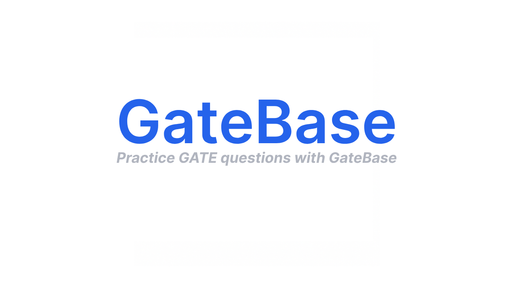
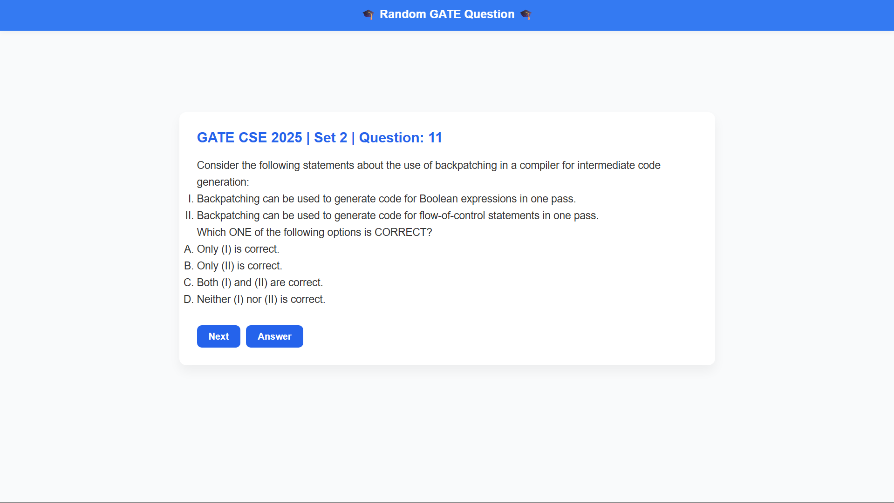

<h3 align="center"></h3>

# 🚀 GateBase — Learn Smarter for GATE CSE

GateBase is a web application that helps GATE Computer Science (CSE) aspirants strengthen their preparation by showing random past-year questions. It offers a simple, clean interface designed to challenge you and improve your problem-solving skills.

## 💡 Features

- 🎯 Randomly fetches past-year GATE CSE questions
- 🧑‍🎓 Encourages self-practice and revision
- 💻 Lightweight, minimal design
- ⚡ Hosted and accessible onli
## 🌐 Live Demo

Check it out here: [GateBase Live](https://gatebase.onrender.com)

## Screenshots 
<h3 align="center"></h3>
<h3 align="center"></h3>

Made with ❤️ by [Subhajit Basak](https://www.linkedin.com/in/subhajit-basak-algobuddha/)